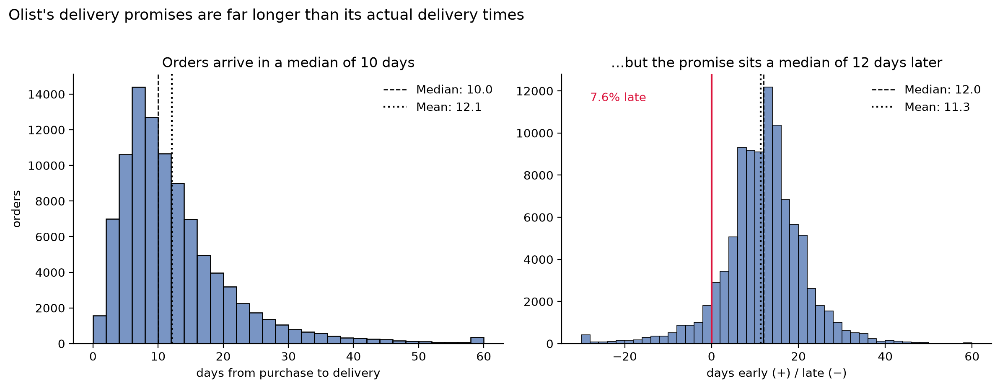

# **Marketplace Analysis**

Olist is a Brazilian e-commerce platform that operates as a marketplace aggregator, allowing small businesses to sell their products directly through the 'Olist Store' on major e-commerce channels. This project provides a marketplace analysis on delivery estimates and seller quality

## Table of Contents

- [Scope](#scope)
- [01 - Delivery Promise Optimization](#01---delivery-promise-optimization)
  * [Analysis Overview](#analysis-overview)
  * [Main Findings](#main-findings)
  * [Recommendation](#recommendation)
- [02 - Seller Quality](#02---seller-quality)
  * [Cleaning and Scoring](#cleaning-and-scoring)
  * [Main Findings](#main-findings-1)
  * [Recommendation](#recommendation-1)
- [02 - Seller Quality](#02---seller-quality)
- [Project Details](#project-details)
- [Repo Structure](#repo-structure)
- [Roadmap](#roadmap)

## Scope

While this dataset could explore several other questions, I narrowed my focus on two criteria: can these nine tables actually answer the question and would the answer help someone at Olist to make a better decision?

The candidates were repeat purchase, category performance, seller quality and freight economics. Repeat purchase failed the first one as only ~3% of customers made >1 orders, while category performance failed the second as Olist acts as marketplace where it doesn't choose it's catalog. "Furniture sells well" is actionable for a store that picks its own stock, but for Olist it isn't the same.

While freight pricing could support some analysis, the dataset has no cost data, so we can't tell if Olist makes or loses money on shipping. Seller quality and delivery estimates optimization pass both.


## **01 - Delivery Promise Optimization**

[](https://colab.research.google.com/github/doniyor117/olist-marketplace-analysis/blob/main/01-delivery-estimates/analysis.ipynb)
[](01-delivery-estimates/analysis.ipynb)

Estimated delivery date is one of the features Olist controls directly. Sellers ship the product and Olist sets the promise at checkout. *It shows customers a delivery date that is typically 23 days across the full dataset, while orders arrive in around 10.* A large buffer protects against breaking the promise, but it also makes the offer look slower than it is, which may hurt Olist against competitors showing tighter dates. That trade-off is what this analysis explores.

This analysis asks:

- **Does the gap between estimated and actual delivered dates vary a lot based on factors like distance or season?**
- **What does a broken promise cost in review score, and what does extra padding bring?**
- **What should the promised date actually be, and what does Olist gain and give up by keeping the current one?**

## Analysis Overview:

I started by measuring the gap directly. For all ~96k orders delivered between 2016 and 2018, I took the promised date and the actual delivery date, calculated their mean and median, and subtracted them to see the padding (days between delivered and estimated dates).



> The left figure shows the distribution of days it took for order deliveries, and we can see right-skewed data, so I used median for my main measures as mean is affected by outliers and the long tail. The right figure is the distribution of paddings. For most orders the delivery takes around 10 days, while the promise sits 12 days beyond that. What stands out is that even with a buffer that large, 7.6% of orders still arrive late.

To know about customer satisfaction and behaviour for the delivery arrival, I examined customer review scores segmented by different delivery bins of paddings below. I used percentiles to find the edges of the bins. (+) when orders arrive early, (-) when it's late.


| Buffer bucket | Days early (+) / late (−) |
| :--- | :--- |
| **very late** | below −5 |
| **late** | −5 to −2 |
| **slightly late** | −2 to −1 |
| **on-time** | −1 to 0 |
| **slightly early** | 0 to 7 |
| **early** | 7 to 16 |
| **very early** | 16 to 26 |
| **extremely early** | above 26 |


> It's obvious from here that late deliveries lower the scores dramatically. Even 2/3 of the very late orders have received the review score 1. Another interesting finding is that early deliveries scored even higher than on time deliveries, and the scores flatten after the early bin no matter how big it is. The score figures were almost the same even when they were checked with distance buckets. This means extending the estimated date doesn't buy extra scores after that point, but lateness hurts a lot.

Since being late costs much more than being early, the promise shouldn't be a best guess of the delivery time. Predicting the average would mean arriving late on half the orders. Say a route's delivery times are 5, 8, 9, 12, 22 days. The average is about 11. Promise 11 days and the 12 and the 22 both miss. Two out of five orders are late.

So instead I trained a LightGBM model to predict a high percentile of delivery time, so the promised date is one the order beats most of the time. The percentile chosen sets the late rate directly.

I also calculated a simple baseline that just finds the 90th percentile delivery time for each seller-state and customer-state pair, to see if a simple state-pair calculation could do the same job.

| Method | Late Rate (%) | Mean Promise (Days) | Median Promise (Days) |
| :--- | :---: | :---: | :---: |
| **olist_native_estimates** | 4.50 | 20.94 | 20.0 |
| **baseline_estimates** | 2.18 | 21.32 | 20.0 |
| **model_estimates** | 3.44 | 17.91 | 17.0 |

Here we have a comparison table for each method. On test dataset Olist predicted ~21 days on average at 4.5% late rate, while our model had ~18 days at 3.44% - noticeably lower on both measures. Baseline method halved the late rate but also increased the delivery estimates beyond Olist's estimates.


> Different alpha levels trade off one gain against another. On p70 we gain the shortest delivery estimates among others (13 days on average) but we increase late rate a lot, over 10%. The reverse happens at p95.

## Main Findings

- Late delivery is very costly. 2/3 of the very late orders (5+ days) were rated 1 star, while extra padding plateaued the scores after the 7-16 day range.
- A LightGBM quantile regression model at p90 gives typical promises of ~18 days at 3.44% late, against Olist's ~21 days at 4.5% on the test data. Shorter and more reliable at the same time.
- Delivery got faster over 2018 while promises didn't follow. The late rate falls to 4.5% in the June-October test window, so the padding was calibrated for how slow Olist used to be.
- Destination state, distance and purchase month drove the model most. A state-pair lookup can't see the last two, which is where the shorter promises come from.

## **Recommendation:**

I recommend using the model with p90 settings as it improves both measures at the same time: ~18 days at 3.44% late, against Olist's ~21 days at 4.5%. Going higher than p90 buys a little more reliability but gives back the shorter promise, and the choice of alpha is a business decision about risk appetite.

---

## **02 - Seller Quality**

[](https://colab.research.google.com/github/doniyor117/olist-marketplace-analysis/blob/main/02-seller-quality/analysis-sql.ipynb)
[](02-seller-quality/analysis-sql.ipynb)

Olist doesn't choose what gets sold on its marketplace, but it chooses who sells. Buyers see one Olist storefront, not separate shops, so a seller who ships late or gets bad reviews drags down how the whole store looks.

This project builds a scorecard for each seller from review scores, shipping times, and cancellations, then groups sellers by what Olist should do about them. The analysis is written in SQL and run on DuckDB; Python is only used to draw the final charts.

This analysis asks:

- **How does seller performance affect Olist, and in what measure?**
- **What share of low review scores do the worst sellers account for?**
- **What should Olist do with each seller: training, incentives, or removal?**

## Cleaning and Scoring

Before scoring anyone, three things needed checking: which order statuses to keep, whether reviews can be tied to a single seller, and whether the shipping and review columns are actually filled in.

97% of the 99,441 orders are `delivered` and 0.63% are `canceled`. 1.3% of orders contain items from more than one seller, so a review on one of those orders can't be blamed on a single seller, and review metrics are built from single-seller orders only. Shipping and cancellation metrics are per item and per order, so they aren't affected. `order_delivered_carrier_date` is missing on 0.002% of delivered orders and `shipping_limit_date` is never missing, so the late-shipment metric is safe, and 99.2% of orders have a review attached.

One bad order out of two looks like a 50% failure rate, so a minimum order count keeps tiny sellers from dominating the tails:

| Cutoff (orders) | Sellers kept | % sellers kept | % orders kept |
| :--- | :---: | :---: | :---: |
| 1 | 3,095 | 100.0 | 100.0 |
| 5 | 1,794 | 58.0 | 97.4 |
| **10** | **1,271** | **41.1** | **93.9** |
| 20 | 818 | 26.4 | 87.7 |
| 30 | 634 | 20.5 | 83.3 |

A cutoff of **10 orders** keeps 41% of sellers but 94% of orders. That drops 1,824 very small sellers who together are only 6% of order volume. The rest of the analysis scores sellers with at least 10 orders; the small sellers are looked at separately as an onboarding question.

## Main Findings


> Scored sellers split into five groups by how often they miss `shipping_limit_date`. The on-time quintile never misses a deadline and averages a 4.30 review score with 7.8% 1-star. The worst quintile misses on a third of orders (32% average) and drops to 3.86 with 16.7% 1-star. Cancellations point the same way but are rare: only 202 scored sellers ever cancel an order, and they average 3.96 against 4.18 for sellers that never cancel.

- **Late shipping is the seller behaviour that tracks review scores most cleanly.** It's also already in the data as `shipping_limit_date`, so it's directly actionable.

Each scored seller was put in one of three tiers from its own numbers: **keep** (average score at least 4.0 and late-shipment rate under 15%), **remove** (average score under 3.0, or late-shipment rate 40%+, or cancellation rate 10%+), and **watch** (everything in between).

| Tier | Sellers | % of sellers | Orders | % of orders | Avg. score | % of all 1-star reviews | Tier 1-star rate |
| :--- | :---: | :---: | :---: | :---: | :---: | :---: | :---: |
| keep | 784 | 61.7 | 61,140 | 65.1 | 4.35 | 46.2 | 8.1 |
| watch | 416 | 32.7 | 30,571 | 32.6 | 3.89 | 40.5 | 14.3 |
| remove | 71 | 5.6 | 2,209 | 2.4 | 3.40 | 5.7 | 28.0 |


> The **remove** tier is 5.6% of scored sellers and 2.4% of orders, and it produces 5.7% of all 1-star reviews. The **watch** tier adds another 40.5%. The **keep** tier, on its own, still produces 46.2% of the marketplace's 1-star reviews, because it carries most of the volume and even good sellers get a 1-star about 8% of the time.

- **The worst sellers are a small share of the problem.** If every watch and remove seller were held to the keep tier's 1-star rate, the single-seller 1-star rate would fall from 10.6% to 8.1%. Real, but not a rescue. Low review scores are spread across the whole seller base, not concentrated in a bad corner of it.


> Sellers with fewer than 10 orders average a 3.96 review score, below the 4.15 that sellers settle at once they pass that volume.

- **New sellers underperform the settled base**, which points to onboarding, not just enforcement, as part of the fix.

## **Recommendation:**

1. **Enforce the shipping deadline.** Late shipping is the seller behaviour that tracks review scores most cleanly, and `shipping_limit_date` is already in the data. Flag sellers whose late rate crosses 15% and escalate at 40%.
2. **Coach the watch tier, don't cut it.** It's a third of orders and a third of 1-star reviews. Moving it toward the keep tier's shipping and rating is where the marketplace-level gain is.
3. **Remove the 71-seller tail only after a warning.** It's 2.4% of orders, so removal is low risk, but it's also a small share of the problem, so it isn't urgent. Most of these sellers are in SP (41 of 71).
4. **Tighten onboarding.** New and very small sellers score below the settled base. A probation period with a shipping SLA would catch the weak ones before they collect 1-star reviews.

On incentives: the dataset has no fee, cost, or margin data, so whether a bonus for on-time shipping would beat plain enforcement can't be tested here.

The three starting questions, answered: seller performance reaches Olist through review scores, driven mostly by late shipping; the worst sellers are a small share of the low scores; and the response is enforcement and coaching, with removal reserved for a short list.

> - **Tools:** SQL, DuckDB, JupySQL, pandas, matplotlib

---

## Project Details

> * **Data:** [Brazilian E-Commerce Public Dataset by Olist](https://www.kaggle.com/datasets/olistbr/brazilian-ecommerce)
> * **Tools:** *Python* - pandas, numpy, matplotlib, seaborn, LightGBM, optuna, scikit-learn


## Repo Structure

```text
├── 01-delivery-estimates/
│   ├── figures/                    # charts exported from the analysis
│   ├── models/
│   │   ├── delivery_p90.txt        # trained LightGBM quantile model
│   │   └── delivery_p90_meta.json  # essential configs for the model
│   └── analysis.ipynb              # analysis: findings, model, recommendation
├── 02-seller-quality/
│   ├── figures/                # charts exported from the SQL analysis
│   ├── sql/                    # queries pulled out of the notebook
│   └── analysis-sql.ipynb      # SQL analysis: seller scorecard and action tiers
├── .gitignore
├── README.md
└── requirements.txt
```

---

## Roadmap
> finished:

- Delivery estimates optimization - Aug 2026
- Seller quality - Sep 2026
